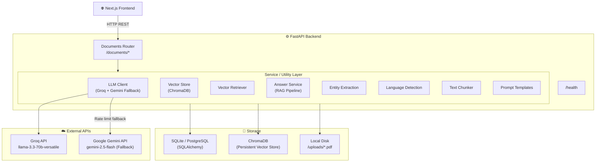
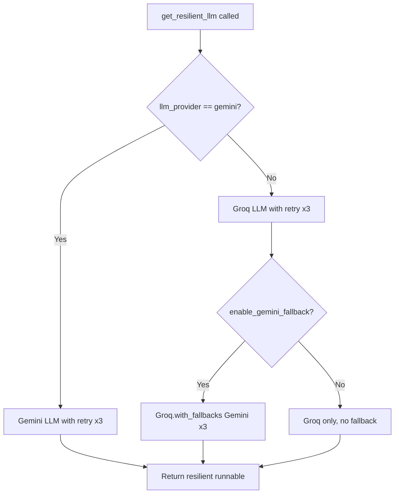
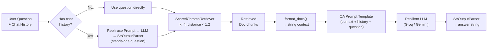
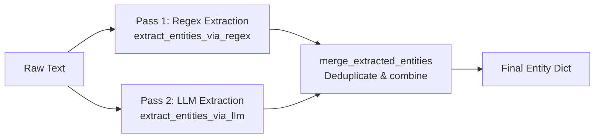
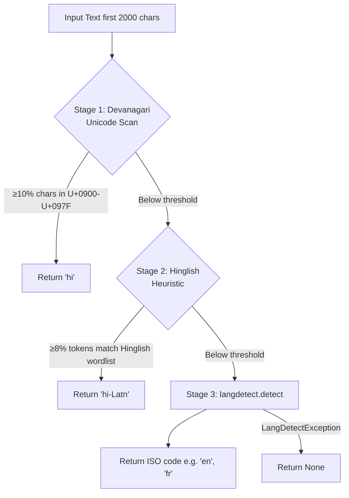
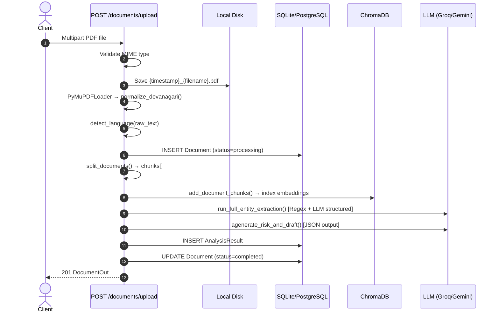
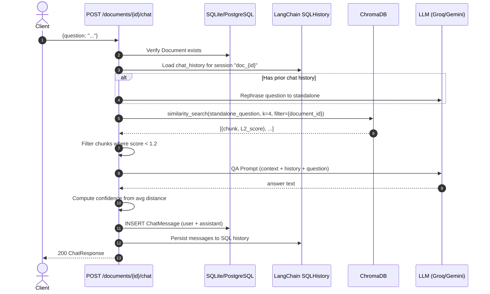

# System API Logic & Data Flow Documentation

> **Project:** DocuMind — AI-Powered Document Intelligence Platform
> **Backend:** FastAPI (Python) · SQLAlchemy · ChromaDB · LangChain · Groq / Gemini LLM
> **Frontend:** Next.js (TypeScript)
> **Generated:** 2026-06-24

---

## Project Folder & File Structure

```
DocMind/
├── backend/
│   ├── .env                          # Environment variables (API keys, DB URL, etc.)
│   ├── .env.example                  # Template for environment setup
│   ├── requirements.txt              # Python dependencies
│   ├── documind.db                   # SQLite fallback database (auto-created)
│   ├── chroma_db/                    # ChromaDB persistent vector store (auto-created)
│   ├── uploads/                      # Uploaded PDF files (auto-created)
│   └── app/
│       ├── __init__.py
│       ├── main.py                   # FastAPI app entry point, CORS, startup events
│       ├── config.py                 # Pydantic settings (env vars, LLM params, thresholds)
│       ├── database.py               # SQLAlchemy engine, session factory, get_db dependency
│       ├── models.py                 # ORM models: Document, AnalysisResult, ChatMessage
│       ├── schemas.py                # Pydantic schemas: DocumentOut, ChatRequest/Response, etc.
│       ├── agents/
│       │   └── __init__.py           # Placeholder for future AI agent modules
│       ├── routers/
│       │   ├── __init__.py
│       │   └── documents.py          # All /documents/* API endpoints (9 routes)
│       └── utils/
│           ├── __init__.py           # Re-exports key utility functions
│           ├── answer_service.py     # Full RAG pipeline, confidence scoring, risk/draft generation
│           ├── entity_extraction.py  # Dual-pass (Regex + LLM) entity extraction & merge
│           ├── language_detection.py # 3-stage language detection (Devanagari / Hinglish / langdetect)
│           ├── llm_client.py         # LLM client with retry logic and Groq→Gemini fallback
│           ├── pdf_extraction.py     # PDF text extraction & Devanagari normalization (PyMuPDF)
│           ├── prompt_templates.py   # Centralized LangChain ChatPromptTemplate definitions
│           ├── rag.py                # Backward-compatible facade delegating to modular services
│           ├── regex_parser.py       # Compiled regex patterns for dates and monetary amounts
│           ├── text_chunking.py      # RecursiveCharacterTextSplitter (text & Document objects)
│           ├── vector_retriever.py   # ChromaDB similarity search with L2 distance filtering
│           └── vector_store.py       # ChromaDB client, collection, chunk add/delete, LangChain wrapper
│
└── frontend/
    ├── package.json
    ├── next.config.ts
    ├── app/
    │   ├── layout.tsx                # Root layout (fonts, global providers)
    │   ├── page.tsx                  # Home / upload landing page
    │   ├── globals.css               # Global styles
    │   ├── analyze/
    │   │   └── [id]/
    │   │       └── page.tsx          # Analysis results page (risk flags, draft reply)
    │   ├── chat/
    │   │   └── [id]/
    │   │       └── page.tsx          # Document Q&A chat page
    │   └── documents/
    │       └── [id]/
    │           └── page.tsx          # Document detail / entity extraction page
    └── components/
        ├── ChatView.tsx              # Chat interface component (messages, input, sources)
        ├── ExtractionView.tsx        # Entity extraction display (parties, dates, amounts)
        ├── RiskAnalysisView.tsx      # Risk flags & draft reply letter display
        ├── Sidebar.tsx               # Document list navigation sidebar
        └── UploadZone.tsx            # Drag-and-drop PDF upload component
```

### File Responsibility Map

| File | Primary Role |
|---|---|
| `main.py` | App factory, CORS, DB/ChromaDB startup initialization |
| `config.py` | Single source of truth for all runtime configuration |
| `database.py` | DB engine with PostgreSQL→SQLite failover, `get_db` dependency |
| `models.py` | SQLAlchemy ORM: `Document`, `AnalysisResult`, `ChatMessage` |
| `schemas.py` | Pydantic I/O contracts for all endpoints |
| `routers/documents.py` | HTTP layer — all 9 document API routes |
| `utils/llm_client.py` | Groq/Gemini abstraction with retry + fallback |
| `utils/vector_store.py` | ChromaDB setup, chunk indexing/deletion, LangChain bridge |
| `utils/vector_retriever.py` | Scored semantic search with distance threshold filtering |
| `utils/answer_service.py` | RAG chain assembly, chat history, confidence scoring |
| `utils/entity_extraction.py` | Regex + LLM dual-pass entity pipeline |
| `utils/language_detection.py` | Devanagari/Hinglish/langdetect 3-stage detection |
| `utils/text_chunking.py` | Chunk splitting (preserves page metadata for LangChain Docs) |
| `utils/prompt_templates.py` | All LangChain prompt templates (QA, risk, entity, rephrase) |
| `utils/pdf_extraction.py` | PyMuPDF text extraction + Unicode normalization |
| `utils/regex_parser.py` | Pattern-based date and currency entity extraction |
| `utils/rag.py` | Backward-compatible delegation facade (do not add logic here) |

---

## Table of Contents

1. [System Architecture Overview](#1-system-architecture-overview)
2. [Application Bootstrap (`main.py`)](#2-application-bootstrap-mainpy)
3. [Infrastructure Layer](#3-infrastructure-layer)
   - [3.1 Database Setup (`database.py`)](#31-database-setup-databasepy)
   - [3.2 Configuration (`config.py`)](#32-configuration-configpy)
   - [3.3 Data Models (`models.py`)](#33-data-models-modelspy)
   - [3.4 Pydantic Schemas (`schemas.py`)](#34-pydantic-schemas-schemaspy)
4. [Documents Router (`/documents`)](#4-documents-router-documents)
   - [4.1 `POST /documents/upload`](#41-post-documentsupload)
   - [4.2 `POST /documents/{document_id}/chat`](#42-post-documentsdocument_idchat)
   - [4.3 `GET /documents/{document_id}/chat`](#43-get-documentsdocument_idchat)
   - [4.4 `PUT /documents/{document_id}/analysis`](#44-put-documentsdocument_idanalysis)
   - [4.5 `POST /documents/{document_id}/analyze` *(Deprecated)*](#45-post-documentsdocument_idanalyze-deprecated)
   - [4.6 `GET /documents/{document_id}/analysis`](#46-get-documentsdocument_idanalysis)
   - [4.7 `GET /documents`](#47-get-documents)
   - [4.8 `GET /documents/{document_id}`](#48-get-documentsdocument_id)
   - [4.9 `DELETE /documents/{document_id}`](#49-delete-documentsdocument_id)
5. [Health Check (`GET /health`)](#5-health-check-get-health)
6. [Core Service Layer — Utilities](#6-core-service-layer--utilities)
   - [6.1 LLM Client (`llm_client.py`)](#61-llm-client-llm_clientpy)
   - [6.2 Vector Store (`vector_store.py`)](#62-vector-store-vector_storepy)
   - [6.3 Vector Retriever (`vector_retriever.py`)](#63-vector-retriever-vector_retrieverpy)
   - [6.4 Answer Service (`answer_service.py`)](#64-answer-service-answer_servicepy)
   - [6.5 Entity Extraction (`entity_extraction.py`)](#65-entity-extraction-entity_extractionpy)
   - [6.6 Language Detection (`language_detection.py`)](#66-language-detection-language_detectionpy)
   - [6.7 Text Chunking (`text_chunking.py`)](#67-text-chunking-text_chunkingpy)
   - [6.8 Prompt Templates (`prompt_templates.py`)](#68-prompt-templates-prompt_templatespy)
7. [End-to-End Data Flow Diagrams](#7-end-to-end-data-flow-diagrams)
8. [Error Handling Reference Table](#8-error-handling-reference-table)
9. [Shared Data Models Reference](#9-shared-data-models-reference)
10. [Key Business Rules & Limitations](#10-key-business-rules--limitations)

---

## 1. System Architecture Overview

DocuMind is a document intelligence platform. Users upload PDF documents; the system extracts text, chunks it, indexes it in a vector database, runs AI analysis, and provides a conversational Q&A interface over the document.



### Component Responsibilities

| Component | Responsibility |
|---|---|
| **Documents Router** | All HTTP request handling, input validation, response serialization |
| **LLM Client** | Unified LLM interface with retry logic and Groq→Gemini failover |
| **Vector Store** | ChromaDB connection, chunk indexing/deletion, LangChain wrapper |
| **Vector Retriever** | Semantic similarity search with distance threshold filtering |
| **Answer Service** | Full RAG pipeline — context retrieval → prompt assembly → LLM → confidence scoring |
| **Entity Extraction** | Dual-pass extraction (Regex + LLM) with structured output and deduplication |
| **Language Detection** | 3-stage detection: Devanagari Unicode scan → Hinglish heuristic → `langdetect` |
| **Text Chunker** | `RecursiveCharacterTextSplitter` over raw text or LangChain `Document` objects |
| **Prompt Templates** | Centralized, parameterized LangChain `ChatPromptTemplate` definitions |

---

## 2. Application Bootstrap (`main.py`)

**File:** [main.py](file:///e:/DocMind/backend/app/main.py)

The FastAPI application is instantiated in `main.py`. It performs these actions at startup:

- **Step 1:** Create a `FastAPI` instance titled `"DocuMind API"`.
- **Step 2:** Register **CORS middleware** with `allow_origins=["*"]` — permitting all origins (suitable for local development, should be restricted in production).
- **Step 3:** Mount the **Documents Router** at the `/documents` prefix.
- **Step 4 (Startup Event — `@app.on_event("startup")`):**
  - Calls `Base.metadata.create_all(bind=engine)` to create all SQLAlchemy ORM tables (idempotent — no-op if tables already exist).
  - Calls `get_collection()` to initialize the ChromaDB persistent client and verify the `SentenceTransformerEmbeddingFunction` loads correctly.
  - If ChromaDB initialization fails, the exception propagates and the server **refuses to start** (fail-fast behavior).

> **Note:** The startup event uses the legacy `@app.on_event("startup")` decorator, which is deprecated in newer FastAPI versions. The recommended pattern is `lifespan` context managers.

---

## 3. Infrastructure Layer

### 3.1 Database Setup (`database.py`)

**File:** [database.py](file:///e:/DocMind/backend/app/database.py)

**Module-level initialization (runs at import time):**

- **Step 1:** Reads `DATABASE_URL` from `settings`.
- **Step 2:** If set, attempts `create_engine(DATABASE_URL)` and runs a test `SELECT 1` query.
- **Step 3:** If connection fails (or `DATABASE_URL` is empty), **falls back to a local SQLite file** at `backend/documind.db`. SQLite uses `check_same_thread=False` to support FastAPI's async request handling.
- **Step 4:** Creates `SessionLocal` — a `sessionmaker` factory with `autocommit=False` and `autoflush=False`.

**`get_db()` — FastAPI Dependency:**
- Yields a fresh `Session` per request.
- Runs a `SELECT 1` health check to confirm DB connectivity.
- Guarantees `db.close()` in a `finally` block regardless of success or failure.
- Raises `OperationalError` if the DB connection is dead (returns 500 to client).

---

### 3.2 Configuration (`config.py`)

**File:** [config.py](file:///e:/DocMind/backend/app/config.py)

All runtime configuration is managed via **Pydantic Settings** with `.env` file support. Key settings:

| Setting | Default | Description |
|---|---|---|
| `llm_provider` | `"groq"` | Primary LLM provider (`"groq"` or `"gemini"`) |
| `llm_model` | `"llama-3.3-70b-versatile"` | Primary Groq model |
| `gemini_model` | `"gemini-2.5-flash"` | Fallback Gemini model |
| `temperature` | `0.0` | LLM temperature (deterministic) |
| `chroma_distance_threshold` | `1.2` | Max L2 distance for a chunk to be considered relevant |
| `max_context_chars` | `12000` | Max characters assembled as RAG context |
| `enable_gemini_fallback` | `True` | Whether to fall back to Gemini on Groq rate limits |
| `embedding_model_name` | `"all-MiniLM-L6-v2"` | SentenceTransformer model for embeddings |
| `chroma_collection_name` | `"documents"` | ChromaDB collection name |

---

### 3.3 Data Models (`models.py`)

**File:** [models.py](file:///e:/DocMind/backend/app/models.py)

Three SQLAlchemy ORM models are defined:

#### `Document`
Primary entity representing an uploaded PDF.

| Column | Type | Description |
|---|---|---|
| `id` | `String(36)` UUID PK | Auto-generated UUID v4 |
| `filename` | `String(255)` | Sanitized original filename |
| `upload_date` | `DateTime(timezone=True)` | UTC timestamp of upload |
| `language` | `String(10)` | Detected ISO language code (e.g. `"en"`, `"hi"`) |
| `raw_text` | `Text` | Full extracted text from the PDF |
| `status` | `Enum(DocumentStatus)` | Lifecycle state (see below) |

**`DocumentStatus` Enum:**
- `pending` — Reserved for future async task queues (not currently used in workflows)
- `processing` — Text is being extracted, chunked, and analyzed
- `completed` — Successfully indexed and analyzed
- `failed` — Processing or indexing failed

#### `AnalysisResult`
One-to-one with `Document`. Stores AI analysis output.

| Column | Type | Description |
|---|---|---|
| `id` | `Integer` PK | Auto-increment |
| `document_id` | `String(36)` FK → `documents.id` | `ondelete="CASCADE"`, `unique=True` |
| `extracted_entities` | `JSON` | Dict of dates, amounts, parties, obligations, suggested_questions |
| `risk_flags` | `JSON` | List of `{clause, reason, level}` dicts |
| `draft_text` | `Text` | Full draft reply letter text |

#### `ChatMessage`
Stores individual messages in the per-document chat history.

| Column | Type | Description |
|---|---|---|
| `id` | `Integer` PK | Auto-increment |
| `document_id` | `String(36)` FK → `documents.id` | `ondelete="CASCADE"` |
| `role` | `Enum(MessageRole)` | `"user"` or `"assistant"` |
| `content` | `Text` | Message text |
| `created_at` | `DateTime(timezone=True)` | UTC creation time |

> **Note:** Both `AnalysisResult` and `ChatMessage` use `ondelete="CASCADE"` at the DB level, so deleting a `Document` automatically cleans up all associated records.

---

### 3.4 Pydantic Schemas (`schemas.py`)

**File:** [schemas.py](file:///e:/DocMind/backend/app/schemas.py)

| Schema | Used In | Key Fields |
|---|---|---|
| `DocumentOut` | Upload, GET detail | `id`, `filename`, `upload_date`, `language`, `status`, `raw_text` |
| `DocumentSummaryOut` | GET list | Same as above but **excludes `raw_text`** to reduce payload size |
| `ChatRequest` | POST chat (request body) | `question: str` |
| `ChatResponse` | POST chat (response) | `answer`, `document_id`, `chunks_used`, `confidence`, `sources` |
| `ChatMessageOut` | GET chat history | `id`, `document_id`, `role`, `content`, `created_at` |
| `AnalysisResultOut` | PUT/POST analyze, GET analysis | `document_id`, `extracted_entities`, `risk_flags`, `draft_text` |

All schemas use `model_config = {"from_attributes": True}` to enable ORM-mode serialization (Pydantic v2).

---

## 4. Documents Router (`/documents`)

**File:** [documents.py](file:///e:/DocMind/backend/app/routers/documents.py)

All routes are prefixed with `/documents` and tagged `"documents"` in the OpenAPI spec.

---

### 4.1 `POST /documents/upload`

**Description:** The primary ingestion endpoint. Accepts a PDF file, processes it end-to-end, and returns the persisted document record.

**Response Model:** `DocumentOut` | **Status:** `201 Created`

#### Input Validation

- **Step 1:** Check `file.content_type`. Must be `"application/pdf"` or `"application/octet-stream"`.
  - If not → `415 Unsupported Media Type` with `"Only PDF files are accepted."`
  - If body is malformed or file is missing → `422 Unprocessable Entity` (FastAPI default)

> **Warning:** `"application/octet-stream"` is a generic binary MIME type. A maliciously renamed `.exe` or `.zip` file can pass this check. The PyMuPDF `fitz.open()` call in Step 3 acts as a second gate but is not a security-sufficient substitute. **Magic-byte validation is the recommended fix.**

#### Phase 1 — File Persistence

- **Step 2:** Generate a UTC `datetime.now(timezone.utc)` timestamp.
- **Step 3:** Sanitize filename: `Path(file.filename).name` (strips path traversal components like `../../etc/passwd`).
- **Step 4:** Construct destination path: `uploads/{YYYYMMDD_HHMMSS_ffffff}_{safe_filename}`.
- **Step 5:** Await `file.read()` and write bytes to disk.
  - If `OSError` → `500 Internal Server Error` with `"Could not save the uploaded file."`

#### Phase 2 — Text Extraction & DB Record Creation

- **Step 6:** Use `PyMuPDFLoader` (LangChain community loader) to load the PDF into a list of `Document` objects (one per page).
- **Step 7:** For each page, apply `normalize_devanagari()` to fix Devanagari Unicode visual-ordering artifacts, zero-width spaces (`\u200b`, `\u200c`, `\u200d`), and null characters (`\x00`).
- **Step 8:** Join all page contents with `"\n"` to produce `raw_text`.
  - If extraction fails → `422 Unprocessable Entity` with `"Could not extract text from the PDF."`
- **Step 9:** Call `detect_language(raw_text)` to get the ISO language code (see §6.6).
- **Step 10:** Create a `Document` ORM record with `status=DocumentStatus.processing`. Commit and refresh to generate the UUID `id`.

> **Note (Error Path):** If any step in Phase 2 raises an exception, the DB transaction is rolled back AND the file written in Step 5 is deleted from disk (`dest_path.unlink(missing_ok=True)`), preventing orphaned files.

#### Phase 3 — Chunking, Indexing & AI Analysis

- **Step 11:** Call `split_documents(docs)` — splits the list of page `Document` objects into `~700`-character chunks with `100`-character overlap, preserving `page` metadata.
- **Step 12:** Call `add_document_chunks(document_id=doc.id, chunks=chunks, filename=doc.filename)` to index all chunks in ChromaDB.
- **Step 13:** Call `run_full_entity_extraction(raw_text, language=language)` — dual-pass regex + LLM entity extraction (see §6.5).
- **Step 14:** Await `agenerate_risk_and_draft(raw_text, language=language)` — LLM risk analysis and draft reply letter (see §6.4).
  - If this sub-call fails, it is caught gracefully: `risk_flags=[]`, `draft_text=""` (non-blocking).
- **Step 15:** Create an `AnalysisResult` ORM record and commit, then update `doc.status = DocumentStatus.completed`.
  
> **Note (Error Path):** If any step in Phase 3 fails, the document status is set to `DocumentStatus.failed` and a `500 Internal Server Error` is returned: `"Document uploaded but indexing failed: ..."`. Note that the DB record and the physical file **are NOT cleaned up** — the document row exists in a `failed` state.

#### Final Response

```json
{
  "id": "a1b2c3d4-...",
  "filename": "lease_agreement.pdf",
  "upload_date": "2026-06-24T10:00:00Z",
  "language": "en",
  "status": "completed",
  "raw_text": "...full extracted text..."
}
```

---

### 4.2 `POST /documents/{document_id}/chat`

**Description:** Accepts a question, runs the full RAG pipeline over the specified document, persists the conversation, and returns the generated answer with confidence and source chunks.

**Response Model:** `ChatResponse` | **Status:** `200 OK`

#### Input Validation

- **Step 1:** `document_id` is a string path parameter (UUID). FastAPI validates it as a non-empty string; format is not further validated here.
- **Step 2:** Request body must match `ChatRequest` schema: `{"question": "..."}`. Missing or empty body → `422 Unprocessable Entity`.

#### Core Processing Flow

- **Step 3:** Query `documents` table by `id`. If not found → `404 Not Found`.
- **Step 4:** Call `await aanswer_question(document_id, payload.question)` — the full async RAG pipeline (see §6.4).
  - If RAG raises → `500 Internal Server Error` with `"RAG query generation failed: ..."`.
- **Step 5:** Create two `ChatMessage` records and commit:
  - `role="user"`, `content=payload.question`
  - `role="assistant"`, `content=rag_response["answer"]`
  - If DB logging fails, **error is logged but does NOT block the response** — the answer is always returned.

#### Final Response

```json
{
  "answer": "The agreement terminates on December 31, 2026.",
  "document_id": "a1b2c3d4-...",
  "chunks_used": 3,
  "confidence": "high",
  "sources": [
    {
      "filename": "lease_agreement.pdf",
      "chunk_index": 2,
      "document_id": "a1b2c3d4-...",
      "page_content": "This agreement shall remain in full force until...",
      "score": 0.42,
      "page": 3
    }
  ]
}
```

**Confidence Levels:**
| Confidence | Condition |
|---|---|
| `"low"` | No chunks retrieved, OR answer contains `"I cannot find the answer"` |
| `"high"` | Average L2 distance of retrieved chunks < `0.6` |
| `"medium"` | Average L2 distance ≥ `0.6` and < `1.0` |
| `"low"` | Average L2 distance ≥ `1.0` |

---

### 4.3 `GET /documents/{document_id}/chat`

**Description:** Retrieves the full sorted chat history (user questions + assistant answers) for a specific document.

**Response Model:** `list[ChatMessageOut]` | **Status:** `200 OK`

#### Core Processing Flow

- **Step 1:** Query `documents` by `id`. If not found → `404 Not Found`.
- **Step 2:** Query `chat_messages` filtered by `document_id`, ordered by `created_at ASC`.
- **Step 3:** Return the list.

> **Note:** Messages are sorted chronologically (oldest first), making this suitable for rendering a full conversation timeline. The `ThreadSafeSQLChatMessageHistory` in `answer_service.py` also writes to this same `chat_messages` table via LangChain's message history integration.

---

### 4.4 `PUT /documents/{document_id}/analysis`

**Description:** Idempotent upsert — runs (or reruns) the full AI analysis pipeline on the document's stored text and saves the result.

**Response Model:** `AnalysisResultOut` | **Status:** `200 OK`

> **Note:** This is the preferred endpoint over the deprecated `POST /analyze`. `PUT` semantics correctly reflect the idempotent upsert nature of this operation.

#### Core Processing Flow

Delegates to the internal `_run_document_analysis(document_id, db)` helper:

- **Step 1:** Query `documents` by `id`. If not found → `404 Not Found`.
- **Step 2 (Text Normalization Check):** Compare `doc.raw_text` with `normalize_devanagari_text(raw_text)`.
  - If they differ (residual encoding artifacts), update `doc.raw_text` in DB and commit.
  - **Re-index ChromaDB:** Delete old chunks via `delete_document_chunks(doc.id)`.
  - **Smart re-chunking:** Try to re-load from the physical PDF file (preserving page numbers via `find_physical_file()`). If the physical file is not found, fall back to `split_text(normalized_text)`.
  - Index new chunks via `add_document_chunks(...)`.
  - If re-indexing fails, the error is logged but does not abort the analysis.
- **Step 3:** Call `run_full_entity_extraction(doc.raw_text, language=doc.language)`.
- **Step 4:** Await `agenerate_risk_and_draft(doc.raw_text, language=doc.language)`.
  - If this fails, gracefully defaults to `risk_flags=[]`, `draft_text=""`.
- **Step 5 (DB Upsert):**
  - Query `analysis_results` by `document_id`.
  - If no record exists → Create and add a new `AnalysisResult`.
  - If record exists → Update `extracted_entities`, `risk_flags`, `draft_text` in place.
  - Commit and refresh.
- **Step 6:** Return the `AnalysisResult` ORM object.

> **Note:** The 30,000-character truncation limit applies. Documents longer than 30,000 characters will have their tail **not analyzed** by the LLM for risk and draft generation, though entity extraction also applies the same truncation independently.

---

### 4.5 `POST /documents/{document_id}/analyze` *(Deprecated)*

**Description:** Performs identical logic to `PUT /documents/{document_id}/analysis`.

**Status:** `200 OK` | **Deprecated:** `True` (marked in OpenAPI spec)

> **Warning:** This endpoint is marked as deprecated in the FastAPI route decorator (`deprecated=True`). It will be removed in a future version. Use `PUT /documents/{document_id}/analysis` instead.

The implementation simply calls `_run_document_analysis(document_id, db)` — the same shared helper as the `PUT` endpoint.

---

### 4.6 `GET /documents/{document_id}/analysis`

**Description:** Retrieves previously computed and stored analysis results (entities, risk flags, draft text) for a document without re-running any AI.

**Response Model:** `AnalysisResultOut` | **Status:** `200 OK`

#### Core Processing Flow

- **Step 1:** Query `analysis_results` table filtered by `document_id`.
- **Step 2:** If no record found → `404 Not Found` with `"No analysis found for document with ID {id}. Run analyze first."`
- **Step 3:** Return the `AnalysisResult` ORM object directly.

> **Note:** This is a pure read operation — no LLM calls, no ChromaDB queries. It is fast and suitable for UI polling or page loads.

---

### 4.7 `GET /documents`

**Description:** Lists metadata for all uploaded documents, newest first. Excludes `raw_text` to keep the payload lightweight.

**Response Model:** `list[DocumentSummaryOut]` | **Status:** `200 OK`

#### Core Processing Flow

- **Step 1:** Query all `Document` records, ordered by `upload_date DESC`.
- **Step 2:** Return the list.

> **Note:** Uses `DocumentSummaryOut` (not `DocumentOut`) to avoid sending the full raw text in list responses — a deliberate performance optimization.

---

### 4.8 `GET /documents/{document_id}`

**Description:** Retrieves full metadata and raw extracted text for a specific document.

**Response Model:** `DocumentOut` | **Status:** `200 OK`

#### Core Processing Flow

- **Step 1:** Query `documents` by `id`.
- **Step 2:** If not found → `404 Not Found` with `"Document with ID {id} was not found."`
- **Step 3:** Return the `Document` ORM object (includes `raw_text`).

---

### 4.9 `DELETE /documents/{document_id}`

**Description:** Permanently and completely deletes a document — database records, ChromaDB vector chunks, and the physical PDF file from disk.

**Status:** `204 No Content`

#### Core Processing Flow

- **Step 1:** Query `documents` by `id`. If not found → `404 Not Found`.
- **Step 2 (Physical File Cleanup):** Call `find_physical_file(doc)` to locate the PDF in `uploads/`:
  - First tries to match the `YYYYMMDD_HHMMSS` timestamp prefix from `doc.upload_date`.
  - Falls back to comparing filesystem `mtime` within a 60-second tolerance window.
  - If found, calls `file_path.unlink(missing_ok=True)`. If deletion fails, the error is **logged but does not abort the operation**.
- **Step 3 (Vector Store Cleanup):** Call `delete_document_chunks(document_id)` to remove all ChromaDB entries where `metadata.document_id == document_id`.
  - If ChromaDB deletion fails, the error is **logged but does not abort DB deletion**.
- **Step 4 (DB Deletion):** Call `db.delete(doc)` and commit.
  - SQLAlchemy cascading (`cascade="all, delete-orphan"`) + DB-level `ondelete="CASCADE"` ensures `analysis_results` and `chat_messages` rows are also deleted.
- **Step 5:** Return empty body with status `204 No Content`.

> **Warning:** This operation is **irreversible**. The physical PDF file, the extracted text in the database, all vector embeddings, all chat history, and all analysis results are permanently destroyed.

---

## 5. Health Check (`GET /health`)

**File:** [main.py](file:///e:/DocMind/backend/app/main.py)

A lightweight endpoint to verify system health.

- **Step 1:** Uses `get_db` dependency to acquire a DB session.
- **Step 2:** Executes `SELECT 1` to verify DB connectivity.
- **Step 3:** If successful → `{"status": "ok", "message": "success"}`.
- **Step 4:** If exception → `{"status": "error", "message": "error"}` (does not raise HTTP exception; returns `200` with error payload).

---

## 6. Core Service Layer — Utilities

---

### 6.1 LLM Client (`llm_client.py`)

**File:** [llm_client.py](file:///e:/DocMind/backend/app/utils/llm_client.py)

The `ConfiguredLLMClient` class (implementing `LLMClientInterface`) manages LLM initialization and provides a resilient call interface.

#### LLM Initialization

- **`get_primary_llm()`:** If `llm_provider == "gemini"`, returns the Gemini LLM. Otherwise initializes a `ChatGroq` instance with `model=settings.llm_model` and `temperature=settings.temperature`. Cached after first call (`_llm`).
- **`get_fallback_llm()`:** Initializes `ChatGoogleGenerativeAI` with `model=settings.gemini_model`. Uses `settings.effective_google_api_key` (prefers `GOOGLE_API_KEY`, falls back to `GEMINI_API_KEY`). Cached after first call (`_gemini_llm`).

#### Resilient LLM (`get_resilient_llm()`)

Returns a LangChain `Runnable` with built-in retry and fallback logic:



- **Retry Policy:** `.with_retry(stop_after_attempt=3)` — uses LangChain's built-in retry wrapper (backed by `tenacity`-style exponential backoff).
- **Fallback:** `.with_fallbacks([gemini_runnable])` — if all Groq retry attempts fail, LangChain transparently invokes the Gemini runnable.

#### Methods

| Method | Description |
|---|---|
| `ask(messages)` | Synchronous LLM invocation via `resilient_llm.invoke()`. Returns stripped string content. |
| `aask(messages)` | Async LLM invocation via `resilient_llm.ainvoke()`. Returns stripped string content. |
| `get_structured_llm(schema)` | Returns a runnable bound to a Pydantic schema using `.with_structured_output(schema)` with the same retry/fallback logic. Used for entity extraction. |

---

### 6.2 Vector Store (`vector_store.py`)

**File:** [vector_store.py](file:///e:/DocMind/backend/app/utils/vector_store.py)

#### Initialization

- **ChromaDB Client:** `chromadb.PersistentClient(path=chroma_dir)` — creates or opens the persistent vector DB at `backend/chroma_db/`.
- **Embedding Function:** `SentenceTransformerEmbeddingFunction(model_name="all-MiniLM-L6-v2")` — a 384-dimension sentence embedding model loaded locally (no API call needed).
- **Collection:** `get_or_create_collection("documents", embedding_function=...)` — idempotent, returns existing or creates new.

#### `add_document_chunks(document_id, chunks, filename)`

- **Step 1:** Guard against empty `chunks` list.
- **Step 2:** Retrieve the ChromaDB collection.
- **Step 3:** Build IDs: `["{document_id}_chunk_{i}" for i in range(len(chunks))]`.
- **Step 4:** For each chunk:
  - If `str`: use directly as document text, metadata: `{document_id, filename, chunk_index}`.
  - If LangChain `Document`: extract `page_content`, add `page` metadata (converted from 0-based to 1-based page numbers), copy any other non-`source` metadata fields.
- **Step 5:** Call `collection.add(documents=..., metadatas=..., ids=...)`. ChromaDB automatically generates and stores embeddings.

#### `delete_document_chunks(document_id)`

- Calls `collection.delete(where={"document_id": document_id})` — removes all chunks matching the metadata filter.

#### `get_vector_store()` — LangChain Wrapper

- Returns a cached LangChain `Chroma` instance wrapping the native ChromaDB client via `ChromaEmbeddingWrapper`.
- `ChromaEmbeddingWrapper` adapts the `SentenceTransformerEmbeddingFunction` (which takes `list[str]`) to the LangChain `Embeddings` interface (`embed_documents(texts)` / `embed_query(text)`).
- This LangChain wrapper enables use of `similarity_search_with_score()` and `asimilarity_search_with_score()` methods.

---

### 6.3 Vector Retriever (`vector_retriever.py`)

**File:** [vector_retriever.py](file:///e:/DocMind/backend/app/utils/vector_retriever.py)

The `ChromaVectorRetriever` (implementing `VectorStoreInterface`) provides scored semantic search with distance filtering.

#### `retrieve_chunks(document_id, question, k=4)` / `aretrieve_chunks(...)`

- **Step 1:** Get the cached LangChain `Chroma` vector store.
- **Step 2:** Call `similarity_search_with_score(query=question, k=k, filter={"document_id": document_id})`.
  - `k` = number of top chunks to retrieve (default: 4).
  - `filter` ensures search is scoped strictly to the requested document.
- **Step 3:** For each `(Document, score)` tuple:
  - Keep only if `score < settings.chroma_distance_threshold` (default `1.2`).
  - The score is an **L2 (Euclidean) distance** — **lower is better**. Chunks above the threshold are discarded as irrelevant.
- **Step 4:** Return list of dicts: `{page_content, metadata, score}`.

> **Note:** Scores of 0.0 indicate an exact or near-exact match. Scores approaching 1.2 are semantically distant. The threshold of 1.2 filters out noise while being permissive enough for paraphrased or cross-lingual queries.

---

### 6.4 Answer Service (`answer_service.py`)

**File:** [answer_service.py](file:///e:/DocMind/backend/app/utils/answer_service.py)

This is the most complex service, implementing the full LangChain RAG pipeline with conversation history support.

#### RAG Chain Architecture



#### `aanswer_question(document_id, question, k=4)` — Async

- **Step 1:** Validate `question` is non-empty, `document_id` is non-null.
- **Step 2:** Get the LangChain vector store and instantiate `ScoredChromaRetriever` with `distance_threshold`.
- **Step 3:** Get the resilient LLM and fetch `response_lang` for the document from the DB (`"Hindi"` or `"English"`).
- **Step 4:** Build the **rephrase chain**: `rephrase_prompt | llm | StrOutputParser()`.
  - If `chat_history` is empty, use the question directly (no rephrasing needed).
  - If `chat_history` exists, invoke rephrase chain to convert the follow-up question into a self-contained standalone question for vector search.
- **Step 5:** Assemble the `RunnableParallel` **retrieve** chain: runs rephrase → retriever.
- **Step 6:** Assemble the **generate** chain: `{context | format_docs, input, chat_history}` → QA prompt → LLM → StrOutputParser.
- **Step 7:** Compose into `rag_chain = retrieve | RunnableParallel(answer=generate, context=...)`.
- **Step 8:** Wrap in `RunnableWithMessageHistory` using `ThreadSafeSQLChatMessageHistory` keyed by `session_id="doc_{document_id}"`.
  - Chat history is persisted in the relational DB via LangChain's `SQLChatMessageHistory`.
  - `ThreadSafeSQLChatMessageHistory` wraps sync DB calls in `asyncio.to_thread()` to avoid event loop blocking.
- **Step 9:** Invoke the chain with `ainvoke({"input": question}, config={"configurable": {"session_id": ...}})`.
- **Step 10:** Extract `retrieved_docs` and `answer` from response.
- **Step 11:** Compute **confidence** (see table in §4.2).
- **Step 12:** Build `sources` list from retrieved doc metadata.
- **Step 13:** Return structured response dict.

#### `agenerate_risk_and_draft(text, language)` — Async

- **Step 1:** Guard against empty text → return `{risk_flags: [], draft_text: ""}`.
- **Step 2:** If `len(text) > 30000` → truncate to first 30,000 characters and log a warning.
- **Step 3:** Determine `response_lang` from language code (`"Hindi (in Devanagari script)"` or `"English"`).
- **Step 4:** Build `JsonOutputParser(pydantic_object=RiskAnalysisAndDraft)` to enforce structured output.
- **Step 5:** Get the risk analysis prompt template (parameterized with `response_lang` and `is_truncated` flag).
- **Step 6:** Build chain: `prompt | resilient_llm | json_parser`.
- **Step 7:** Await `chain.ainvoke({"context": truncated_text})`.
- **Step 8:** Validate response contains `risk_flags` and `draft_text` keys; default to empty if missing.
- **Step 9:** Return the dict.
  - On any exception → log error and return `{"risk_flags": [], "draft_text": "Failed to generate draft reply due to an internal error."}`.

#### `ScoredChromaRetriever`

A custom LangChain `BaseRetriever` that wraps `Chroma.similarity_search_with_score()` and attaches the distance `score` to each document's `metadata` dict, enabling downstream confidence scoring.

#### `get_document_language(document_id)`

Fetches the document's `language` field from the DB and maps it to a human-readable name (`"Hindi"` or `"English"`) for use in prompt localization.

---

### 6.5 Entity Extraction (`entity_extraction.py`)

**File:** [entity_extraction.py](file:///e:/DocMind/backend/app/utils/entity_extraction.py)

#### `run_full_entity_extraction(text, language)` — Two-Pass Pipeline



- **Step 1 (Regex Pass):** `extract_entities_via_regex(text)` from `regex_parser.py` — uses compiled regex patterns to find standard date formats and currency amounts.
- **Step 2 (LLM Pass):** `extract_entities_via_llm(text, language)`:
  - Truncates text to 30,000 characters.
  - Determines language instruction strings for Hindi vs. English.
  - Builds `get_entity_extraction_prompt(lang_instruction, questions_lang)`.
  - Uses **structured output** (`default_llm_client.get_structured_llm(ExtractedEntities)`) — the LLM returns a Pydantic model directly.
  - Post-filters results: strips whitespace, removes items with `"context"` in text (hallucination guard), enforces length limits.
- **Step 3 (Merge):** `merge_extracted_entities(regex_entities, llm_entities)`:
  - Concatenates both lists per field.
  - Deduplicates case-insensitively (lowercased set membership).
  - `suggested_questions` are taken solely from the LLM pass (regex cannot generate these).

**`ExtractedEntities` Pydantic Schema:**
```python
class ExtractedEntities(BaseModel):
    dates: List[str]
    amounts: List[str]
    parties: List[str]
    obligations: List[str]
    suggested_questions: List[str]
```

---

### 6.6 Language Detection (`language_detection.py`)

**File:** [language_detection.py](file:///e:/DocMind/backend/app/utils/language_detection.py)

Three-stage detection applied to the **first 2,000 characters** of the text:



| Stage | Method | Returns |
|---|---|---|
| 1 | Devanagari character ratio ≥ 10% | `"hi"` |
| 2 | Romanized Hinglish token ratio ≥ 8% | `"hi-Latn"` |
| 3 | `langdetect.detect()` | Any ISO 639-1 code |
| Fallback | `LangDetectException` | `None` |

> **Note:** Stages 1 and 2 exist because `langdetect` frequently misclassifies Hindi Devanagari text as Nepali or Bengali, and Hinglish (Hindi in Latin script) as English. The custom pre-checks dramatically improve accuracy for the primary use case of this platform.

---

### 6.7 Text Chunking (`text_chunking.py`)

**File:** [text_chunking.py](file:///e:/DocMind/backend/app/utils/text_chunking.py)

Two functions wrapping LangChain's `RecursiveCharacterTextSplitter`:

| Function | Input | Output | Page Metadata |
|---|---|---|---|
| `split_text(text, ...)` | `str` | `list[str]` | ❌ Lost |
| `split_documents(docs, ...)` | `list[Document]` | `list[Document]` | ✅ Preserved |

**Default Parameters:**
- `chunk_size = 700` characters
- `chunk_overlap = 100` characters
- `separators = ["\n\n", "\n", " ", ""]` (tried in order; earlier separators preferred to preserve semantic boundaries)

> **Note:** `split_documents` is preferred over `split_text` during upload and re-analysis because it preserves `page` metadata from PyMuPDFLoader, allowing the frontend to show exact page references in source citations.

---

### 6.8 Prompt Templates (`prompt_templates.py`)

**File:** [prompt_templates.py](file:///e:/DocMind/backend/app/utils/prompt_templates.py)

All prompts are `ChatPromptTemplate` instances built from `langchain_core.prompts`.

#### `get_qa_prompt(response_lang="English")`

Used in: `answer_question`, `aanswer_question`

- **System:** Identifies the LLM as a document Q&A assistant constrained to the provided context only. Includes `response_lang` for localization. Features a `MessagesPlaceholder` for `chat_history` to enable multi-turn conversation.
- **Human:** `{input}` — the user's question.
- **Strict Rules:** LLM must reply with `"I cannot find the answer in the provided document context."` verbatim if the answer is absent — this exact string is checked for confidence flagging.

#### `get_risk_analysis_prompt(response_lang, is_truncated=False)`

Used in: `generate_risk_and_draft`, `agenerate_risk_and_draft`

- **System:** Expert legal advisor role. Identifies risky/unfair/confusing clauses with categorized risk levels.
  - **HIGH:** Unilateral termination rights, unreasonably short notice periods, clearly unfair payment terms.
  - **MEDIUM:** Vague language, missing standard protections, unclear liability.
  - **LOW:** Minor formatting, optional or boilerplate clauses.
- If `is_truncated=True`, adds Rule 4 instructing the LLM not to reference sections not present in the extract.
- Enforces JSON output format via `{format_instructions}` from `JsonOutputParser`.

#### `get_entity_extraction_prompt(lang_instruction, questions_lang)`

Used in: `extract_entities_via_llm`

- Single structured extraction call. The LLM is instructed to extract **all 5 entity types in one shot** (parties, dates, amounts, obligations, suggested_questions) using Pydantic structured output.
- Includes bilingual instructions for obligations and suggested_questions.

#### `get_rephrase_prompt()`

Used in: `answer_question`, `aanswer_question` (only when `chat_history` is non-empty)

- Instructs the LLM to convert a follow-up question (in the context of chat history) into a standalone, self-contained question suitable for vector search without access to history.
- Does not answer the question — purely transforms the query.

---

## 7. End-to-End Data Flow Diagrams

### Document Upload Flow



### RAG Chat Flow



---

## 8. Error Handling Reference Table

| HTTP Status | Trigger Condition | Endpoint(s) |
|---|---|---|
| `400 Bad Request` | Empty or invalid question | `POST /chat` (via `ValueError`) |
| `404 Not Found` | Document ID does not exist | All `/{document_id}/*` endpoints |
| `404 Not Found` | Analysis result does not exist | `GET /analysis` |
| `415 Unsupported Media Type` | Non-PDF MIME type on upload | `POST /upload` |
| `422 Unprocessable Entity` | Missing required fields (FastAPI) | All endpoints with body |
| `422 Unprocessable Entity` | PDF text extraction fails | `POST /upload` |
| `500 Internal Server Error` | File write to disk fails | `POST /upload` |
| `500 Internal Server Error` | ChromaDB indexing or LLM analysis fails | `POST /upload` |
| `500 Internal Server Error` | RAG pipeline fails | `POST /chat` |
| `204 No Content` | Successful delete | `DELETE /{document_id}` |

---

## 9. Shared Data Models Reference

### Request Bodies

| Schema | Endpoint | Fields |
|---|---|---|
| `ChatRequest` | `POST /chat` | `question: str` |

### Response Bodies

| Schema | Returned By | Notable Fields |
|---|---|---|
| `DocumentOut` | `POST /upload`, `GET /{id}` | Includes full `raw_text` |
| `DocumentSummaryOut` | `GET /` (list) | Excludes `raw_text` |
| `ChatResponse` | `POST /chat` | `answer`, `confidence`, `sources[]` with `page` numbers |
| `ChatMessageOut` | `GET /{id}/chat` | `role` (`user`/`assistant`), `created_at` |
| `AnalysisResultOut` | `PUT/POST /analyze`, `GET /analysis` | `extracted_entities{}`, `risk_flags[]`, `draft_text` |

---

## 10. Key Business Rules & Limitations

> [!IMPORTANT]
> **30,000 Character Truncation Limit:** Both `extract_entities_via_llm` and `generate_risk_and_draft` truncate the input to the **first 30,000 characters** before sending to the LLM. Documents exceeding this length will have their tail sections unanalyzed. This is a cost and latency trade-off. The truncation is logged at `WARNING` level.

> [!WARNING]
> **MIME Type Bypass Risk:** The upload endpoint accepts `"application/octet-stream"` as a valid content type. Any binary file with this MIME type (or renamed to `.pdf`) can be uploaded. PyMuPDF will reject non-PDF files during extraction, but **the file is still written to disk first**. Magic-byte validation should be added before the file write step.

> [!WARNING]
> **Deprecated Endpoint:** `POST /documents/{document_id}/analyze` is marked `deprecated=True` in OpenAPI. New clients should use `PUT /documents/{document_id}/analysis` instead. The deprecated endpoint will be removed in a future version.

> [!NOTE]
> **LLM Determinism:** All LLM calls use `temperature=0.0`. This maximizes determinism and reproducibility of entity extraction, risk analysis, and Q&A answers. Changing this value will affect output consistency.

> [!NOTE]
> **Dual Chat History Systems:** The application maintains chat history in **two places**: (1) the `chat_messages` table (used by `GET /chat` for the conversation timeline UI), and (2) LangChain's `SQLChatMessageHistory` (used internally by the RAG chain for context-aware rephrasing). Both write to the same underlying database but via different mechanisms.

> [!NOTE]
> **ChromaDB Persistence:** All vector embeddings are stored persistently at `backend/chroma_db/`. Re-deploying the application without this directory will result in an empty vector store, requiring re-upload or re-analysis of all documents.

> [!TIP]
> **Re-analysis Use Case:** `PUT /documents/{document_id}/analysis` can be used to "repair" a document stuck in `failed` or with stale analysis data without re-uploading. It also triggers Devanagari normalization, fixing any encoding artifacts from earlier ingestion before re-indexing ChromaDB.
